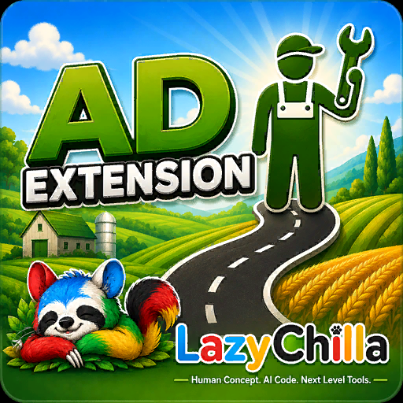

  

# LazyChilla AD Extension

**Extension for [AutoDrive](https://github.com/Stephan-S/FS25_AutoDrive) (FS25_AutoDrive) — adds a customizable quick-access button bar to the AutoDrive HUD.**

🇩🇪 [Deutsch](#deutsch) · 🇬🇧 [English](#english) · 🇫🇷 [Français](#français) · 🇮🇹 [Italiano](#italiano) · 🇵🇹 [Português](#português) · 🇪🇸 [Español](#español)

---

## Deutsch

### Was macht der Mod?
LazyChilla AD Extension fügt dem AutoDrive-HUD eine frei belegbare Schnellzugriff-Leiste hinzu. Ganz rechts ein fester **Refresh-Button** (zurück zum vorherigen AD-Ziel), daneben ein fester **Werkstatt-Button**, dann beliebig viele **dynamische Buttons** — jeweils mit einem Icon aus 27 verfügbaren Icons belegt. Ziele werden mit dem gleichen Mechanismus gesetzt wie der Parkplatz in AutoDrive.

### Features
- **Refresh-Button** fest ganz rechts — stellt den vorherigen AD-Zustand wieder her; der Zustand wird vor jedem Zielwechsel automatisch gemerkt und überlebt pro Fahrzeug das Neuladen (Spielstand)
- **Werkstatt-Button** fest daneben — immer verfügbar, ein Klick zur Hofwerkstatt
- **`[+]` Button** öffnet einen Icon-Picker mit 27 Icons direkt über dem HUD
- **Beliebig viele Buttons** — bei voller Reihe automatisch zweite Zeile drüber
- **Persistent gespeichert** — Buttons und Ziele bleiben nach Neustart erhalten
- **Mehrspieler-tauglich** — jeder Spieler hat seine eigene Button-Leiste
- **Unbelegte Buttons** erscheinen transparent, belegte voll sichtbar
- **Kein Eingriff in AutoDrive** — reine Erweiterung über Lua-Hooks, keine AD-Dateien verändert
- **Hover-Sichtbarkeit** — Buttons erscheinen nur wenn die Maus über dem AD-HUD ist

### Installation
1. [FS25_AutoDrive](https://github.com/Stephan-S/FS25_AutoDrive) muss installiert sein (Voraussetzung)
2. `FS25_AD_Extension.zip` in den `mods`-Ordner von Farming Simulator 25 kopieren
3. Spiel starten, Mod im Mod-Manager aktivieren

### Bedienung
| Aktion | Wie |
|---|---|
| Neuen Button hinzufügen | `[+]` klicken → Icon auswählen |
| Ziel setzen | Im AD-HUD gewünschten Marker auswählen, dann **Rechtsklick** auf den Button — genau wie beim Setzen des Parkplatzes |
| Zum Ziel fahren | **Linksklick** auf den Button |
| Button löschen | **SHIFT + Linksklick** auf den Button |
| Vorheriges Ziel wiederherstellen | **Linksklick** auf den Refresh-Button (ganz rechts) |
| Aktuellen Zustand merken | **Rechtsklick** auf den Refresh-Button |
| Werkstatt / Refresh (Tastenbelegung) | `STRG + ALT + W` / `STRG + ALT + R` (frei änderbar in den Spieleinstellungen) |

### Voraussetzungen
- Farming Simulator 25
- FS25_AutoDrive (aktuelle Version)

### Download
👉 [Neueste Version herunterladen](https://github.com/LazyChilla/FS25_AD_Extension/releases/latest)

### Fehler melden / Mitwirken
Bug gefunden oder Idee für ein Feature? Bitte ein [Issue](../../issues/new/choose) eröffnen — **immer mit der ganzen `log.txt`** (`Dokumente\My Games\FarmingSimulator2025\log.txt`). Fehlt im Log die Zeile `[ADExt] ... geladen`, war der Mod gar nicht aktiv.

---

## English

### What does this mod do?
LazyChilla AD Extension adds a customizable quick-access button bar to the AutoDrive HUD. On the far right a fixed **Refresh button** (back to the previous AD destination), next to it a fixed **Workshop button**, then as many **dynamic buttons** as you like — each assigned one of 27 available icons. Destinations are set using the same mechanism as the AutoDrive parking spot.

### Features
- **Refresh button** fixed on the far right — restores the previous AD state; the state is remembered automatically before each target change and survives reload per vehicle (savegame)
- **Workshop button** fixed next to it — always available, one click to the farm workshop
- **`[+]` button** opens an icon picker with 27 icons directly above the HUD
- **Unlimited buttons** — wraps to a second row automatically when the first row is full
- **Persistent storage** — buttons and destinations survive game restarts
- **Multiplayer ready** — each player has their own button bar
- **Unassigned buttons** appear dimmed, assigned ones fully visible
- **No AutoDrive files modified** — pure extension via Lua hooks, AD itself stays untouched
- **Hover visibility** — buttons only appear while the mouse is over the AD HUD

### Installation
1. [FS25_AutoDrive](https://github.com/Stephan-S/FS25_AutoDrive) must be installed (required dependency)
2. Copy `FS25_AD_Extension.zip` into your Farming Simulator 25 `mods` folder
3. Launch the game, enable the mod in the mod manager

### Usage
| Action | How |
|---|---|
| Add new button | Click `[+]` → select icon |
| Set destination | Select the desired marker in the AD HUD, then **right-click** the button — same as setting a parking spot |
| Drive to destination | **Left-click** the button |
| Delete button | **SHIFT + Left-click** the button |
| Restore previous destination | **Left-click** the Refresh button (far right) |
| Remember current state | **Right-click** the Refresh button |
| Workshop / Refresh (keybinding) | `CTRL + ALT + W` / `CTRL + ALT + R` (freely remappable in game settings) |

### Requirements
- Farming Simulator 25
- FS25_AutoDrive (current version)

### Download
👉 [Download latest release](https://github.com/LazyChilla/FS25_AD_Extension/releases/latest)

### Report a bug / Contributing
Found a bug or have a feature idea? Please open an [issue](../../issues/new/choose) — **always with the whole `log.txt`** (`Documents\My Games\FarmingSimulator2025\log.txt`). If the line `[ADExt] ... geladen` is missing from the log, the mod was not active.

---

## Français

### Que fait ce mod ?
LazyChilla AD Extension ajoute une barre de raccourcis personnalisable au HUD d'AutoDrive. Tout à droite un **bouton Refresh** fixe (retour à la destination AD précédente), à côté un **bouton Atelier** fixe, puis autant de **boutons dynamiques** que vous voulez — chacun associé à une icône parmi 27 disponibles. Les destinations se définissent avec le même mécanisme que la place de parking AutoDrive.

### Fonctionnalités
- **Bouton Refresh** fixe tout à droite — restaure l'état AD précédent ; l'état est mémorisé automatiquement avant chaque changement de destination et survit au rechargement par véhicule (sauvegarde)
- **Bouton Atelier** fixe à côté — toujours disponible, un clic vers l'atelier
- **Bouton `[+]`** ouvre un sélecteur d'icônes avec 27 icônes directement au-dessus du HUD
- **Boutons illimités** — passage automatique à une deuxième ligne quand la première est pleine
- **Sauvegarde persistante** — boutons et destinations conservés après redémarrage
- **Compatible multijoueur** — chaque joueur a sa propre barre de boutons
- **Boutons non assignés** apparaissent en transparence, les assignés en pleine visibilité
- **Aucune modification d'AutoDrive** — extension pure via hooks Lua, les fichiers AD restent intacts
- **Visibilité au survol** — les boutons n'apparaissent que lorsque la souris survole le HUD AD

### Installation
1. [FS25_AutoDrive](https://github.com/Stephan-S/FS25_AutoDrive) doit être installé (dépendance requise)
2. Copiez `FS25_AD_Extension.zip` dans le dossier `mods` de Farming Simulator 25
3. Lancez le jeu et activez le mod dans le gestionnaire de mods

### Utilisation
| Action | Comment |
|---|---|
| Ajouter un bouton | Cliquer `[+]` → sélectionner une icône |
| Définir une destination | Sélectionnez le marqueur souhaité dans le HUD AD, puis **clic droit** sur le bouton — comme pour définir une place de parking |
| Aller à la destination | **Clic gauche** sur le bouton |
| Supprimer un bouton | **SHIFT + Clic gauche** sur le bouton |
| Restaurer la destination précédente | **Clic gauche** sur le bouton Refresh (tout à droite) |
| Mémoriser l'état actuel | **Clic droit** sur le bouton Refresh |
| Atelier / Refresh (raccourci) | `CTRL + ALT + W` / `CTRL + ALT + R` (modifiable dans les paramètres du jeu) |

### Prérequis
- Farming Simulator 25
- FS25_AutoDrive (version actuelle)

### Download
👉 [Télécharger la dernière version](https://github.com/LazyChilla/FS25_AD_Extension/releases/latest)

### Signaler un bug / Contribuer
Bug trouvé ou idée de fonctionnalité ? Ouvrez une [issue](../../issues/new/choose) — **toujours avec le `log.txt` complet** (`Documents\My Games\FarmingSimulator2025\log.txt`). Si la ligne `[ADExt] ... geladen` manque dans le log, le mod n'était pas actif.

---

## Italiano

### Cosa fa questa mod?
LazyChilla AD Extension aggiunge una barra di accesso rapido personalizzabile all'HUD di AutoDrive. Tutto a destra un **pulsante Refresh** fisso (ritorno alla destinazione AD precedente), accanto un **pulsante Officina** fisso, poi tutti i **pulsanti dinamici** che vuoi — ognuno abbinato a un'icona tra 27 disponibili. Le destinazioni si impostano con lo stesso meccanismo del parcheggio AutoDrive.

### Caratteristiche
- **Pulsante Refresh** fisso tutto a destra — ripristina lo stato AD precedente; lo stato viene memorizzato automaticamente prima di ogni cambio di destinazione e sopravvive al ricaricamento per veicolo (salvataggio)
- **Pulsante Officina** fisso accanto — sempre disponibile, un click verso l'officina
- **Pulsante `[+]`** apre un selettore di icone con 27 icone direttamente sopra l'HUD
- **Pulsanti illimitati** — passa automaticamente a una seconda riga quando la prima è piena
- **Salvataggio persistente** — pulsanti e destinazioni conservati dopo il riavvio
- **Compatibile multiplayer** — ogni giocatore ha la propria barra di pulsanti
- **Pulsanti non assegnati** appaiono trasparenti, quelli assegnati completamente visibili
- **Nessuna modifica ad AutoDrive** — estensione pura tramite hook Lua, i file di AD restano intatti
- **Visibilità al passaggio del mouse** — i pulsanti appaiono solo quando il mouse è sopra l'HUD AD

### Installazione
1. [FS25_AutoDrive](https://github.com/Stephan-S/FS25_AutoDrive) deve essere installato (dipendenza richiesta)
2. Copia `FS25_AD_Extension.zip` nella cartella `mods` di Farming Simulator 25
3. Avvia il gioco e attiva la mod nel gestore mod

### Utilizzo
| Azione | Come |
|---|---|
| Aggiungere un pulsante | Clicca `[+]` → seleziona un'icona |
| Impostare destinazione | Seleziona il marcatore desiderato nell'HUD AD, poi **click destro** sul pulsante — come impostare un parcheggio |
| Andare alla destinazione | **Click sinistro** sul pulsante |
| Eliminare un pulsante | **SHIFT + Click sinistro** sul pulsante |
| Ripristinare la destinazione precedente | **Click sinistro** sul pulsante Refresh (tutto a destra) |
| Memorizzare lo stato attuale | **Click destro** sul pulsante Refresh |
| Officina / Refresh (tasto) | `CTRL + ALT + W` / `CTRL + ALT + R` (modificabile nelle impostazioni di gioco) |

### Requisiti
- Farming Simulator 25
- FS25_AutoDrive (versione attuale)

### Download
👉 [Scarica l'ultima versione](https://github.com/LazyChilla/FS25_AD_Extension/releases/latest)

### Segnalare un bug / Contribuire
Hai trovato un bug o hai un'idea? Apri una [issue](../../issues/new/choose) — **sempre con l'intero `log.txt`** (`Documenti\My Games\FarmingSimulator2025\log.txt`). Se nel log manca la riga `[ADExt] ... geladen`, la mod non era attiva.

---

## Português

### O que este mod faz?
LazyChilla AD Extension adiciona uma barra de acesso rápido personalizável ao HUD do AutoDrive. Na extrema direita um **botão Refresh** fixo (volta ao destino AD anterior), ao lado um **botão Oficina** fixo, depois quantos **botões dinâmicos** quiser — cada um com um ícone entre 27 disponíveis. Os destinos são definidos com o mesmo mecanismo do estacionamento do AutoDrive.

### Funcionalidades
- **Botão Refresh** fixo na extrema direita — restaura o estado AD anterior; o estado é memorizado automaticamente antes de cada troca de destino e sobrevive ao recarregamento por veículo (savegame)
- **Botão Oficina** fixo ao lado — sempre disponível, um clique para a oficina
- **Botão `[+]`** abre um seletor de ícones com 27 ícones diretamente acima do HUD
- **Botões ilimitados** — passa automaticamente para uma segunda linha quando a primeira está cheia
- **Armazenamento persistente** — botões e destinos mantidos após reinicialização
- **Compatível com multijogador** — cada jogador tem a sua própria barra de botões
- **Botões não atribuídos** aparecem transparentes, os atribuídos totalmente visíveis
- **Nenhuma alteração no AutoDrive** — extensão pura via hooks Lua, os arquivos do AD permanecem intactos
- **Visibilidade ao passar o mouse** — os botões só aparecem quando o mouse está sobre o HUD do AD

### Instalação
1. [FS25_AutoDrive](https://github.com/Stephan-S/FS25_AutoDrive) precisa estar instalado (dependência obrigatória)
2. Copie `FS25_AD_Extension.zip` para a pasta `mods` do Farming Simulator 25
3. Inicie o jogo e ative o mod no gerenciador de mods

### Uso
| Ação | Como |
|---|---|
| Adicionar botão | Clique em `[+]` → selecione um ícone |
| Definir destino | Selecione o marcador desejado no HUD do AD, depois **clique direito** no botão — igual a definir um estacionamento |
| Ir ao destino | **Clique esquerdo** no botão |
| Apagar botão | **SHIFT + Clique esquerdo** no botão |
| Restaurar destino anterior | **Clique esquerdo** no botão Refresh (extrema direita) |
| Memorizar o estado atual | **Clique direito** no botão Refresh |
| Oficina / Refresh (tecla) | `CTRL + ALT + W` / `CTRL + ALT + R` (alterável nas configurações do jogo) |

### Requisitos
- Farming Simulator 25
- FS25_AutoDrive (versão atual)

### Download
👉 [Baixar a versão mais recente](https://github.com/LazyChilla/FS25_AD_Extension/releases/latest)

### Reportar um bug / Contribuir
Encontrou um bug ou tem uma ideia? Abra uma [issue](../../issues/new/choose) — **sempre com o `log.txt` inteiro** (`Documentos\My Games\FarmingSimulator2025\log.txt`). Se faltar a linha `[ADExt] ... geladen` no log, o mod não estava ativo.

---

## Español

### ¿Qué hace este mod?
LazyChilla AD Extension añade una barra de acceso rápido personalizable al HUD de AutoDrive. En el extremo derecho un **botón Refresh** fijo (volver al destino AD anterior), al lado un **botón Taller** fijo, y luego tantos **botones dinámicos** como quieras — cada uno con un icono entre 27 disponibles. Los destinos se fijan con el mismo mecanismo que el aparcamiento de AutoDrive.

### Características
- **Botón Refresh** fijo en el extremo derecho — restaura el estado AD anterior; el estado se memoriza automáticamente antes de cada cambio de destino y sobrevive a la recarga por vehículo (partida guardada)
- **Botón Taller** fijo al lado — siempre disponible, un clic hacia el taller
- **Botón `[+]`** abre un selector de iconos con 27 iconos directamente sobre el HUD
- **Botones ilimitados** — pasa automáticamente a una segunda fila cuando la primera está llena
- **Almacenamiento persistente** — botones y destinos se mantienen tras reiniciar
- **Compatible con multijugador** — cada jugador tiene su propia barra de botones
- **Botones sin asignar** aparecen atenuados, los asignados completamente visibles
- **Sin modificar AutoDrive** — extensión pura mediante hooks Lua, los archivos de AD quedan intactos
- **Visibilidad al pasar el ratón** — los botones solo aparecen cuando el ratón está sobre el HUD de AD

### Instalación
1. [FS25_AutoDrive](https://github.com/Stephan-S/FS25_AutoDrive) debe estar instalado (dependencia requerida)
2. Copia `FS25_AD_Extension.zip` en la carpeta `mods` de Farming Simulator 25
3. Inicia el juego y activa el mod en el gestor de mods

### Uso
| Acción | Cómo |
|---|---|
| Añadir botón | Haz clic en `[+]` → selecciona un icono |
| Fijar destino | Selecciona el marcador deseado en el HUD de AD, luego **clic derecho** en el botón — igual que fijar un aparcamiento |
| Ir al destino | **Clic izquierdo** en el botón |
| Eliminar botón | **MAYÚS + Clic izquierdo** en el botón |
| Restaurar destino anterior | **Clic izquierdo** en el botón Refresh (extremo derecho) |
| Memorizar el estado actual | **Clic derecho** en el botón Refresh |
| Taller / Refresh (tecla) | `CTRL + ALT + W` / `CTRL + ALT + R` (modificable en los ajustes del juego) |

### Requisitos
- Farming Simulator 25
- FS25_AutoDrive (versión actual)

### Download
👉 [Descargar la última versión](https://github.com/LazyChilla/FS25_AD_Extension/releases/latest)

### Reportar un fallo / Contribuir
¿Encontraste un fallo o tienes una idea? Abre una [issue](../../issues/new/choose) — **siempre con el `log.txt` completo** (`Documentos\My Games\FarmingSimulator2025\log.txt`). Si falta la línea `[ADExt] ... geladen` en el log, el mod no estaba activo.

---

## Changelog

### v1.3.0.0
- Multiplayer fix: clients can now assign and drive the quick-access buttons (dynamic slots + workshop); the Refresh button now shows and works correctly for clients.
- Refresh button (far right): restore the previous AD task (left-click) or remember the current one (right-click); the previous state is saved automatically before each target change and survives reload per vehicle.
- Added Spanish; housekeeping (removed unused icon files); updated for the current FS25 version.

### v1.2.0.x
- New Refresh button and per-vehicle state snapshot (saved in the savegame).

### v1.1.0.1
- Dynamic buttons and icon picker (27 icons).

---

## License / Lizenz / Licence / Licenza / Licença / Licencia

MIT License — see [LICENSE](LICENSE) for details.

## Credits

- Mod by **LazyChilla**
- Built on top of [FS25_AutoDrive](https://github.com/Stephan-S/FS25_AutoDrive) by Stephan-S and contributors
